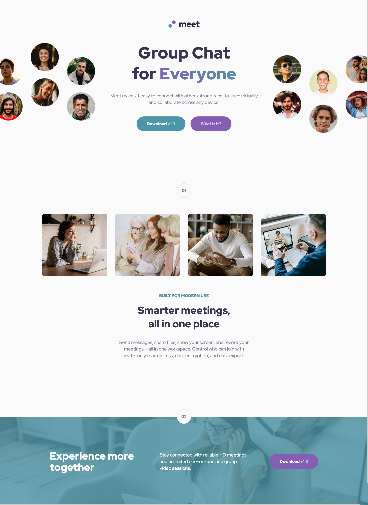

# Frontend Mentor - Meet landing page solution!

This is a solution to the [Meet landing page challenge on Frontend Mentor](https://www.frontendmentor.io/challenges/meet-landing-page-rbTDS6OUR). Frontend Mentor challenges help you improve your coding skills by building realistic projects. 

## Table of contents

- [Overview](#overview)
  - [The challenge](#the-challenge)
  - [Screenshot](#screenshot)
  - [Links](#links)
- [My process](#my-process)
  - [Built with](#built-with)
  - [What I learned](#what-i-learned)
  - [Useful resources](#useful-resources)
- [Author](#author)

### Screenshot

### Links

- Solution URL: [Frontend Mentor Solution](https://www.frontendmentor.io/solutions/meet-landing-page-vanilla-css-logo-animation-easter-eggs-f0N4MR9dc9)
- Live Site URL: [Live Site at Vercel](https://meet-landing-page-2.vercel.app/)
## My process

### Built with

- Semantic HTML5 markup
- BEM
- Grid
- Responsive Design

### What I learned

For sure the best thing I learned in this challenge, was CSS property 'order', because using this property I was able to animate the logo on hover using the selector "~" affecting one div that was before the element hovered, in this case was the logo icon that get animated when I hover on the word "meet".

Example: 

".meet {
  order: 2;
  transition: ease-out 1s;
}

/* logo hover effect */
.meet,
.icon {
  transition: ease-out 1s;
}

.meet:hover~.icon {
  transform: rotate(720deg);
  filter: blur(1px);
  transition: cubic-bezier(0.65, 0.05, 0.36, 1) 1s;
}

.icon:hover {
  transform: rotate(-720deg);
  filter: blur(1px);
  transition: cubic-bezier(0.65, 0.05, 0.36, 1) 1s;
}"

### Useful resources

- [W3 Schools - Order](https://www.w3schools.com/cssref/css3_pr_order.asp) - Order Property

## Author
- Github - [correlucas](https://github.com/correlucas/)
- Frontend Mentor - [@correlucas](https://www.frontendmentor.io/profile/correlucas)
